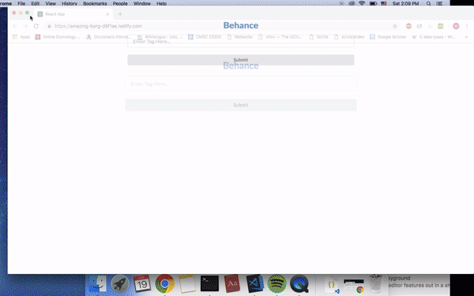

# react-front-end image search

The assignment: 
React app that uses the Behance public API. 
The user can enter tags to search for and a submit button (Use redux for the form). After clicking the submit button the page will show a count of images with the tags searched for, grouped per user

## Demo

  

# Important Notes
1. CORS (access-control-allow-origin)  
If using chrome, please install https://chrome.google.com/webstore/detail/allow-control-allow-origi/nlfbmbojpeacfghkpbjhddihlkkiljbi?hl=en if necessary

2. responsive design  
I was going to use breakpoints but semantics ui offers a “stackable grid” shortcut so I chose to use that one instead. The folder for responsive designs are there just for reference.
